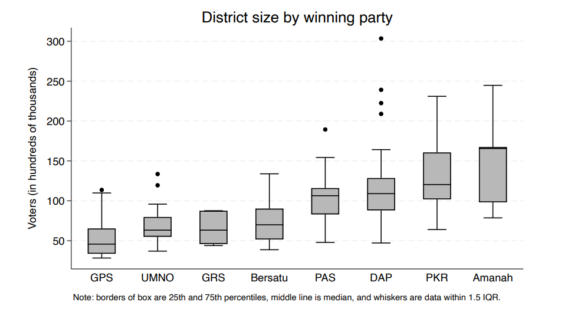

```{r setup, include = FALSE}

knitr::opts_chunk$set(echo = FALSE, 
                      warning = FALSE, 
                      message = FALSE, 
                      fig.width = 9)


library(tidyverse)
library(here)
library(janitor)
library(scales)
library(tidytext)
library(widyr)
library(ggraph)
library(patchwork)
library(kableExtra)
library(viridis)
library(stringr)
library(sf)
library(broom)

`%out%` <- Negate(`%in%`)
options(scipen = 100)
theme_set(theme_light())
range_wna <- function(x){(x-min(x, na.rm = TRUE))/(max(x, na.rm = TRUE)-min(x, na.rm = TRUE))}

Mode <- function(x) {
  ux <- unique(x)
  ux[which.max(tabulate(match(x, ux)))]
}

last_comma <- function(x, sep = ","){
  x <- sapply(strsplit(x, sep),"[")
  trimws(x[[length(x)]])
}
```


```{r data}

candidates <- rbind(
  read_csv("./data/candidates_ge12.csv") |>
    mutate(election = "ge12", new_mp = NA_real_), 
  read_csv("./data/candidates_ge13.csv") |>
    mutate(election = "ge13", new_mp = NA_real_), 
  read_csv("./data/candidates_ge14.csv") |>
    mutate(election = "ge14", new_mp = NA_real_), 
  read_csv("./data/candidates_ge15.csv") |>
    mutate(election = "ge15") |>
    select(-name) |>
    rename(name = name_display)) 

results <- rbind(
  read_csv("./data/results_parlimen_ge12.csv"),
  read_csv("./data/results_parlimen_ge13.csv"),
  read_csv("./data/results_parlimen_ge14.csv"),
  read_csv("./data/results_parlimen_ge15.csv")
)

census_dun <- read_csv("./data/census_dun.csv") |> 
  mutate(population_bumi = ethnicity_proportion_bumi * population_total / 100, 
         population_chinese = ethnicity_proportion_chinese * population_total/ 100, 
         population_indian = ethnicity_proportion_indian * population_total / 100, 
         population_other = ethnicity_proportion_other * population_total / 100)

voters_ge15 <- read_csv("./data/voters_ge15.csv")

candidates <- candidates |> 
  left_join(
    candidates |> 
      group_by(parlimen, election) |> 
      summarise(total_votes = sum(votes)), 
    by = c("parlimen", "election")
  ) |> 
  mutate(vote_share = votes / total_votes) |> 
  ungroup() |> 
  # Result in errors where both candidates won
  mutate(result = 
           case_when(
             votes == 15495 & election == "ge13" & parlimen == "P.170 Tuaran" ~ 
               0, 
             votes == 12155 & election == "ge13" & parlimen == "P.177 Beaufort" ~ 
               0, 
             votes == 11900 & election == "ge13" & parlimen == "P.180 Keningau" ~ 
               0, 
             TRUE ~ result), 
         result_dec = 
           case_when(
             votes == 15495 & election == "ge13" & parlimen == "P.170 Tuaran" ~ 
               "lost", 
             votes == 12155 & election == "ge13" & parlimen == "P.177 Beaufort" ~ 
               "lost", 
             votes == 11900 & election == "ge13" & parlimen == "P.180 Keningau" ~ 
               "lost", 
             TRUE ~ result_desc))

gini <- read_csv("./data/hh_inequality_parlimen.csv") |> 
  filter(date == "2024-01-01")


sf::sf_use_s2(FALSE)

parlimen_geo <- read_sf("./data/parlimen.geojson") |> 
  st_make_valid() |> 
  mutate(area_km2 = st_area(geometry) / 1000000, 
         area_km2 = as.numeric(area_km2))

federal_territories <- tribble(
  ~parlimen, ~population_total, ~pc_bumi, ~pc_chinese, ~pc_indian, ~pc_other, ~sex_male, ~sex_female, ~population_density, ~income_avg, ~expenditure_avg, ~poverty_incidence, ~area_km2,
  "P.114 Kepong", 106199, .202, .729, .063, .006, .588, .412, 8850, 13087, 6500, .003, 12,
  "P.115 Batu", 219132, .566, .301, .129, .004, .601, .399, 10957, 11019, 5817, 0, 20,
  "P.116 Wangsa Maju", 215600, .617, .306, .07, .008, .537, .463, 13475, 11153, 5768, 0, 16,
  "P.117 Segambut", 253715, .324, .558, .107, .012, .512, .479, 4975, 20521, 9845, 0, 51,
  "P.118 Setiawangsa", 147095, .697, .214, .085, .004, .519, .481, 9193, 12281, 6534, .003, 16, 
  "P.119 Titiwangsa", 122096, .677, .233, .076, .014, .519, .481, 8140, 11921, 6823, .005, 15,
  "P.120 Bukit Bintang", 120529, .271, .565, .155, .009, .565, .435, 5739, 13677, 7401, 0, 21, 
  "P.121 Lembah Pantai", 148094, .591, .262, .138, .009, .509, .491, 7405, 13081, 6186, 0, 20,
  "P.122 Seputeh", 322511, .311, .573, .112, .004, .510, .490, 10404, 13489, 7764, .005, 31,
  "P.123 Cheras", 135823, .322, .596, .076, .007, .527, .473, 8489, 12031, 5979, .002, 16,
  "P.124 Bandar Tun Razak", 191318, .679, .234, .083, .004, .509, .491, 7653, 11266, 6002, 0, 25,
  "P.166 Labuan", 95120, .862, .117, .011, .01, .514, .486, 1034, 8319, 4097, .031, 96,
  "P.125 Putrajaya", 109202, .979, .012, .006, .003, .509, .491, 2229, 12840, 7980, .004, 49
  
)

census_fed <- census_dun |> 
  mutate(population_poor = poverty_incidence * population_total / 100) |> 
  group_by(parlimen) |> 
  summarise_at(
    c("population_total", 
      "population_bumi", 
      "population_chinese", 
      "population_indian", 
      "population_other", 
      "population_poor", 
      "sex_male", 
      "sex_female"), 
    ~ sum(.x, na.rm = TRUE)
  ) |> 
  mutate_at(
    c("population_bumi", 
      "population_chinese", 
      "population_indian", 
      "population_other", 
      "population_poor", 
      "sex_male", 
      "sex_female"), 
    ~ .x / population_total
  ) |>  
  rename(
    pc_bumi = population_bumi, 
    pc_chinese = population_chinese, 
    pc_indian = population_indian, 
    pc_other = population_other, 
    poverty_incidence = population_poor) |> 
  left_join(
    census_dun |>
      mutate(
        income = income_avg * household_total,
        expenditure = expenditure_avg * household_total) |>
      group_by(parlimen) |>
      summarise(
        household_total = sum(household_total),
        income = sum(income),
        expenditure = sum(expenditure)) |>
      mutate(
        income_avg = income / household_total,
        expenditure_avg = expenditure / household_total) |>
      select(parlimen,
             income_avg, 
             expenditure_avg), 
    by = "parlimen") |> 
  left_join(
    parlimen_geo |> 
      st_drop_geometry() |> 
      select(parlimen, area_km2), 
    by = "parlimen"
  ) |> 
  mutate(population_density = population_total / area_km2) |> 
  rbind(federal_territories) |> 
  left_join(
    census_dun |> 
      distinct(parlimen, state), 
    by = "parlimen"
  ) |>
  left_join(
    gini |> 
      select(parlimen, gini), 
    by = "parlimen"
  ) |> 
  mutate(state = case_when(
    is.na(state) & str_detect(parlimen, "Labuan") ~ "Labuan", 
    is.na(state) & str_detect(parlimen, "Putrajaya") ~ "Putrajaya", 
    is.na(state) ~ "Kuala Lumpur", 
    TRUE ~ state
  )) |> 
  mutate(east_malaysia = ifelse(str_detect(state, "Sabah|Sarawak|Labuan"), 
                                1, 0))

ballots <- read_csv("./data/consol_ballots.csv") |> 
  mutate(
    age = ifelse(age == -1, NA_real_, age)
  ) |> 
  mutate(federal = ifelse(
    str_detect(seat, "P.0|P.1|P.2"), 
    "Federal", 
    "State"))

stats <- read_csv("./data/consol_stats.csv")

parlimen_geo <- read_sf("./data/parlimen.geojson") |> 
  st_make_valid() |> 
  mutate(area_km2 = st_area(geometry) / 1000000, 
         area_km2 = as.numeric(area_km2))

state_expenditures <- read_csv("./data/state_finance_expenditure.csv")

median_age <- tribble(~year, ~median_age, 
                      1950, 18.8, 
                      1955, 17.4, 
                      1960, 16.5, 
                      1965, 15.6, 
                      1970, 16.3, 
                      1975, 17.5, 
                      1980, 18.7, 
                      1985, 19.7, 
                      1990, 20.4, 
                      1995, 21.5, 
                      2000, 22.5, 
                      2005, 23.2, 
                      2010, 25, 
                      2015, 26.8, 
                      2020, 28.6)
```


**Acronyms**
```{r table-acronyms, echo = FALSE, message=FALSE, warning=FALSE}
tribble(
  ~acronym, ~name, 
  "BN", "Barisan Nasional",  
  "DAP", "Democratic Action Party",
  "GRS", "Gabungan Rakyat Sabah", 
  "GPS", "Gabnungan Parti Sarawak",
  "MCA", "Malaysian Chinese Association", 
  "MIC", "Malaysian Indian Congress", 
  "PAS", "Parti Islam Se-Malaysia", 
  "PH", "Pakatan Harapan", 
  "PKR", "Parti Keadilan Rakyat", 
  "PN", "Perikatan Nasional", 
  "SUPP", "Sarawak United People's Party", 
  "UMNO", "United Malays National Organisation", 
  "USA", "United Sabah Alliance"
) |>  
  kable(col.names = NULL, format = "html") |> 
  kable_classic(bootstrap_options = c("condensed"), 
                full_width = FALSE, 
                position = "float_left")
```

<br>

# Introduction

Malaysia has a multi-party, first-past-the-post parliamentary system. It is a constitutional monarchy with a "federal structure with power [nominally](https://sci-hub.box/10.2139/ssrn.3048551) divided between federal and state levels, though in practice, it is highly centralised". 

```{r census-summary, warning=FALSE, message=FALSE}
census_summary <- read_csv("./data/population_malaysia.csv") |> 
  mutate(population = population * 1000) |> 
  filter(ethnicity != "overall" & age == "overall" & sex == "both") |> 
  filter(date == "2025-01-01") |> 
  mutate(total = sum(population), 
         pc = round(population / total * 100, 1))
```

In 2025, [Malaysia](https://open.dosm.gov.my/) had a multi-ethnic population of 34.2 million people, with `r filter(census_summary, ethnicity == "bumi_malay") |> pull(pc)`% of the population being Malay, `r filter(census_summary, ethnicity == "chinese") |> pull(pc)`% being Chinese, `r filter(census_summary, ethnicity == "indian") |> pull(pc)`% being Indian, `r filter(census_summary, ethnicity == "bumi_other") |> pull(pc)`% being non-Malay indigenous bumiputera groups, `r filter(census_summary, ethnicity == "other_citizen") |> pull(pc)`% being other races and `r filter(census_summary, ethnicity == "other_noncitizen") |> pull(pc)`% being non-citizens. 

Prior to 2018, Malaysia had been considered to have one of the [least-honest and most-manipulated electoral systems](https://sci-hub.box/10.2139/ssrn.3048551) in the world, ranking 142^nd^ out of 158 countries assessed by the Electoral Integrity Project and falling into the "Very Low/Failed" category alongside countries like Afghanistan, Zimbabwe and Vietnam. A more [recent report in 2025](https://static1.squarespace.com/static/58533f31bebafbe99c85dc9b/t/6866ad9714bd8c1f780fc489/1751559585725/Year+in+Elections+PEI+11+Report+.pdf) believes Malaysia to have one of the most-improved electoral systems, moving up into a more middling category, ranking between Myanmar and Iraq. 

However, the major issues facing Malaysia's electoral system remain [shockingly numerous](https://sci-hub.box/10.2139/ssrn.3048551): malapportionment, lack of judicial independence, partisanship of the Electoral Commission and other institutions, racialisation of politics and Malay supremacism, restrictions on political speech and civil society, discrepancies in vote tallying, vote buying and clientalisation of key voting blocs, post-election manipulations, capture of institutional media by political parties and mass corruption. 

We will be looking through election ballot data compiled by [Thevesh](https://github.com/Thevesh/paper-meco-results/tree/main) to explore some of these issues and quantify them. 

<br><br><br>

## An overview of elections and candidates

```{r seats-summary}
seats_summary <- ballots |> 
  group_by(federal, date) |> 
  summarise(seats = n_distinct(seat)) |> 
  group_by(federal) |> 
  summarise(seats = sum(seats))
```


Since 1955, There have been a cumulative `r seats_summary |> filter(federal == "Federal") |> pull(seats) |> format(big.mark = ",")` federal-level and `r seats_summary |> filter(federal == "State") |> pull(seats) |> format(big.mark = ",")` state-level elections involving `r ballots |> summarise(value = n_distinct(candidate_uid)) |> pull(value) |> format(big.mark = ",")` different candidates. 

Legislative candidates are overwhelmingly male. Analyst [Yong Pey Jung](https://www.wfd.org/commentary/strategies-inclusive-politics-and-boosting-womens-representation-malaysia) noted that it took 27 years (7 elections) for women MPs to rise above 5% of the total, and 44 years (11 elections) to surpass 10%. After 63 years of democracy, female MPs still form less than 15% of parliament: 

<br>

```{r candidates-sex, fig.height=3}

ballots |>
  group_by(sex, federal) |> 
  summarise(candidates = n_distinct(candidate_uid), .groups = "drop") |> 
  mutate(sex = ifelse(sex == "F", "Female", "Male")) |> 
  ggplot(aes(x = candidates, y = fct_rev(sex))) + 
  geom_col(aes(fill = sex)) + 
  geom_text(aes(label = comma(candidates)), 
            hjust = "inward", 
            colour = "grey30") +
  scale_fill_viridis_d() + 
  facet_grid(vars(federal), 
             scales = "free_x", space = "free") + 
  theme(strip.background = element_rect(fill = "grey20"), 
        legend.position = "none") + 
  scale_fill_viridis_d(begin = .2, end = .9) +
  scale_x_continuous(labels = comma) +
  labs(x = "Number of candidates", 
       y = "", 
       fill = "", 
       title = "Malaysian election candidates are overwhelmingly male")
```

<br>

Elections in the post-1990 period have been dominated by incumbents and long-tenured politicians, with lower rates of participation from newer candidates. 

[Liew Chin Tong](https://liewchintong.com/2020/10/21/1990-the-election-year-that-changed-malaysia/), a DAP politician, posits that 1990 was a watershed year in Malaysian politics as it was the beginning of a nearly three-decade long period of Barisan Nasional and UMNO dominance, largely led by Mahathir Mohamad. It is arguable that the culmination of [patriarchal and patronage systems](https://eastasiaforum.org/2019/05/08/patronage-based-business-as-usual-in-new-malaysia/) was Mahathir Mohamad's re-election as the world's oldest Prime Minister in 2018. 

```{r eval=FALSE}
ballots |>  
    mutate(
      post_90s = ifelse(
        date < "1990-10-20", "Jul 1955 - Sep 1990", "Oct 1990 - Jan 2026")) |> 
    mutate(count = 1) |> 
    group_by(post_90s, candidate_uid, federal) |> 
    summarise(
      count = sum(count),
      win_count = sum(count[str_detect(result, "won")], na.rm = TRUE),
      .groups = "drop"
    ) |> 
  # Manual correction because somehow the calculation is not working for Ku Li
  mutate(win_count = ifelse(win_count == 9, 8, win_count)) |> 
  filter(win_count > 0) |> 
  group_by(federal, win_count, post_90s) |> 
  summarise(candidates = n_distinct(candidate_uid), 
            .groups = "drop") |> 
  filter(win_count > 4) |> 
  group_by(post_90s) |> 
  summarise(candidates = sum(candidates))
```

In the 35 years since 1990, 205 politicians have won 5 or more federal or state elections, including including Ku Li, who has won 12 federal and 1 state election in his career). The number of politicians who won 5 or more elections in the 35 years from 1955 to 1990 was only 79. 

<br>


```{r imcumbency}
ballots |>  
    mutate(
      post_90s = ifelse(
        date < "1990-10-20", "Jul 1955 - Sep 1990", "Oct 1990 - Jan 2026")) |> 
    mutate(count = 1) |> 
    group_by(post_90s, candidate_uid, federal) |> 
    summarise(
      count = sum(count),
      win_count = sum(count[str_detect(result, "won")], na.rm = TRUE),
      .groups = "drop"
    ) |> 
  # Manual correction because somehow the calculation is not working for Ku Li
  mutate(win_count = ifelse(win_count == 9, 8, win_count)) |> 
  filter(win_count > 0) |> 
  group_by(federal, win_count, post_90s) |> 
  summarise(candidates = n_distinct(candidate_uid), 
            .groups = "drop") |> 
  ggplot(aes(x = win_count, 
             y = candidates)) + 
  geom_col(fill = "#2d708eff") + 
  geom_text(aes(label = candidates), 
            vjust = "inward") +
  facet_wrap(~ post_90s + federal) + 
  scale_x_continuous(breaks = seq(0, 10, 1)) +
  scale_y_continuous(labels = comma) + 
  labs(title = "More incumbents post-1990 election", 
       subtitle = "Only shows candidates who have won at least one election", 
       y = "Number of MPs", 
       x = "Number of electoral wins") + 
  theme(strip.background = element_rect(fill = "grey30"))

```

<br>

The long period of stability and ossification has resulted in politicians being more aged, as their (over)stay in parliament lengthens. This trend towards gerontocracy can also be noted in the plot below, which shows the average age of MPs increasing significantly since 1990. 

<br>

```{r candidate-age}

ballots |> 
  mutate(count = 1) |> 
  filter(rank == 1 & !is.na(age)) |> 
  mutate(
      post_90s = ifelse(
        date < "1990-10-20", "Jul 1955 - Sep 1990", "Oct 1990 - Jan 2026")) |> 
  ggplot(aes(x = age)) + 
  geom_histogram(fill = "#21908cff") + 
  geom_vline(
    aes(xintercept = mean), 
    data = ballots |> 
      mutate(count = 1) |> 
      filter(rank == 1 & !is.na(age)) |>
      mutate(post_90s = ifelse(date < "1990-10-20", "Jul 1955 - Sep 1990", "Oct 1990 - Jan 2026")) |> 
      group_by(federal, post_90s) |> 
      summarise(mean = mean(age, na.rm = TRUE)), 
    colour = "#440154ff", 
    linetype = "dashed",
    linewidth = .7
  ) +
  facet_wrap(~ post_90s + federal) + 
  theme(strip.background = element_rect(fill = "grey30")) +
  labs(title = "Federal and state MPs have become more aged", 
       subtitle = "Dotted line marks the mean age",
       y = "Number of MPs", 
       x = "Age of MPs")

```

<br>

The participation of Malay candidates in federal elections was at its lowest in the 1970s. However, this share has increased every decade since, and is now higher than any time except for before the formation of the federation (when elections were limited to just peninsula Malaysia). Malay politicians' participation in state elections, conversely, is now at the lowest it has ever been, largely due to increased participation from Sabah and Sarawak Bumi candidates. 

The participation of Sabah and Sarawak Bumis in federal elections was at its highest in the 1970s, right after the formation of the federation, and has been decreasing ever since. The share of Chinese candidates has been decreasing every decade, though so has their share of the total population.

<br>

```{r candidate-ethnicity}
ballots |> 
  mutate(ethnicity = ifelse(
    ethnicity == "Orang Asli", "Other", ethnicity
  )) |> 
  mutate(year = year(date), 
         decade = year - year %% 10, 
         count = 1) |> 
  group_by(decade, ethnicity, federal) |> 
  summarise(count = sum(count)) |> 
  group_by(decade, federal) |> 
  mutate(total = sum(count)) |> 
  ungroup() |> 
  mutate(pc = count / total) |> 
  ggplot(aes(x = decade, 
             y = pc, 
             fill = ethnicity)) + 
  geom_col(position = "stack") + 
  facet_wrap(~ federal) + 
  scale_y_continuous(labels = percent) + 
  scale_x_continuous(breaks = seq(1950, 2020, 10)) +
  scale_fill_viridis_d() + 
  theme(axis.text.x = element_text(angle = 30, vjust = .5), 
        strip.background = element_rect(fill = "black")) + 
  labs(title = "Ethnicity of election candidates", 
       y = "% of candidates", 
       x = "")  
```

<br><br><br>

# Malapportionment 

[Constitutional limits on malapportionment](https://penanginstitute.org/wp-content/uploads/jml/files/malapportionment/Malapportionment-Report-2.0-20161022.pdf) in Malaysia were relaxed in 1962 and removed entirely in 1973. In 2017, the Electoral Integrity Project ranked Malaysia's electoral boundaries as the most biased of the 155 countries assessed. 

On the international stage, Malaysia' system of malapportionment is indefensible. By [UK law](https://www.parliament.uk/about/how/elections-and-voting/constituencies/#:~:text=number%20of%20MPs-,How%20many%20people%20live%20in%20each%20parliamentary%20constituency?,constituency%2C%20covering%206.8%20square%20km.), except for five protected constituencies, the number of electors per constituency may vary no more than 5% of the quota of 73,393 electors. Even in less fair systems, like [Japan](https://fairvote.org/japan-s-electoral-unfairness-goes-deeper-than-malapportionment/), electoral districts were rearranged so that the largest district has 2.34 times more electors than the smallest district. 

From the plot below, we can see the extreme deviations in constituency size in Malaysia, resulting in a vote in Kanowit being worth almost 28 times a vote in Bangi. 

<br>

```{r race-malapportionment}

census_fed |> 
  mutate_at(
    vars("pc_bumi", "pc_chinese", "pc_indian", "pc_other", 
         "poverty_incidence", "sex_male", "sex_female"),
    ~ .x * population_total
  ) |> 
  rename_all(
    .funs = ~ gsub("pc_", "", .)) |> 
  pivot_longer(
    cols = bumi:other, 
    names_to = "ethnicity", 
    values_to = "value"
  ) |> 
  mutate(ethnicity = str_to_title(ethnicity)) |> 
  select(parlimen, 
         ethnicity, 
         value, 
         population_total) |> 
  ggplot(aes(y = value, fill = ethnicity, 
             x = fct_reorder(str_sub(parlimen, start = 1L, end = 5L), 
                             population_total))) + 
  geom_col(width = 1) + 
  scale_fill_viridis_d(option = "plasma") + 
  theme(axis.text.x = element_text(size = .5, angle = 90), 
        plot.subtitle = element_text(size = 10)) +
  scale_y_continuous(labels = number_format(scale = .001, suffix = "k"), 
                     breaks = seq(0, 700000, 100000)) + 
  labs(x = "Parliamentary seat", 
       y = "Constituency population", 
       title = "Massive parliamentary misapportionment", 
       subtitle = "The MP of the largest constituency (Bangi) represents 27.8 times more people than the MP of the smallest constituency (Kanowit)", 
       fill = "")

#ggsave("./plots/parliamentary_misapportionment.png", height = 5.7, width = 10, units = "in")
```

<br>

In spite of this massive inequality in the worth of a vote, calls for redelineation have faced numerous [political challenges](https://www.iseas.edu.sg/wp-content/uploads/2024/03/ISEAS_Perspective_2024_30.pdf): Zahid Hamidi suggested that redelineation "would be unfavourable to Malays"; this was echoed by Selangor UMNO chief. 

But let's look at the data. In the plot below, we compare each races' share of the population against their share of votes. As the Department of Statistics does not provide a constituency-level breakdown of Bumiputera sub-groups, we can still divide the population into East Malaysia and Peninsula. Bumiputeras in peninsula Malaysia form 54.05% of the country's population, but 52.47% of the vote share. 

Malapportionment does not benefit Malays; even if it did, it would still not be a valid argument. 


<br>

```{r race-peninsula-vote-share, fig.height=5}
census_fed |> 
  mutate(east_malaysia = ifelse(east_malaysia == 1, "East Malaysia", "Peninsula")) |> 
  mutate_at(
    vars("pc_bumi", "pc_chinese", "pc_indian", "pc_other", 
         "poverty_incidence", "sex_male", "sex_female"),
    ~ .x * population_total
  ) |> 
  rename_all(
    .funs = ~ gsub("pc_", "", .)) |> 
  pivot_longer(
    cols = bumi:other, 
    names_to = "ethnicity", 
    values_to = "value"
  ) |> 
  select(parlimen, 
         east_malaysia,
         ethnicity, 
         value, 
         population_total) |> 
  mutate(ethnicity = str_to_title(ethnicity)) |> 
  group_by(ethnicity, east_malaysia) |> 
  summarise(value = sum(value), 
            .groups = "drop") |> 
  mutate(total = sum(value), 
         pc = value / total) |> 
  ggplot(aes(x = pc, 
             y = fct_rev(ethnicity))) + 
  geom_col(aes(fill = ethnicity)) +
  geom_text(aes(label = round(pc * 100, 2)), 
            colour = "grey40", 
            hjust = "inward") +
  scale_fill_viridis_d(option = "plasma") + 
  theme(legend.position = "none") +
  scale_x_continuous(labels = percent, 
                     breaks = seq(0, .8, .1)) + 
  labs(title = "Share of population", 
       x = "", y = "") + 
  facet_wrap(~ fct_rev(east_malaysia), ncol = 1) +
  theme(strip.background = element_rect(fill = "grey20")) +
  
census_fed |> 
  mutate(east_malaysia = ifelse(east_malaysia == 1, "East Malaysia", "Peninsula")) |> 
  mutate_at(
    vars("pc_bumi", "pc_chinese", "pc_indian", "pc_other", 
         "poverty_incidence", "sex_male", "sex_female"),
    ~ .x * population_total
  ) |> 
  rename_all(
    .funs = ~ gsub("pc_", "", .)) |> 
  pivot_longer(
    cols = bumi:other, 
    names_to = "ethnicity", 
    values_to = "value"
  ) |> 
  select(parlimen, 
         east_malaysia,
         ethnicity, 
         value, 
         population_total) |> 
  mutate(share = population_total / 687609) |> 
  mutate(votes = value / share) |> 
  group_by(ethnicity, east_malaysia) |> 
  summarise(votes = sum(votes), 
            .groups = "drop") |> 
  mutate(total = sum(votes), 
         pc = votes / total) |> 
  mutate(ethnicity = str_to_title(ethnicity)) |> 
  ggplot(aes(x = pc, 
             y = fct_rev(ethnicity))) + 
  geom_col(aes(fill = ethnicity)) +
  geom_text(aes(label = round(pc * 100, 2)), 
            colour = "grey40", 
            hjust = "inward") +
  scale_fill_viridis_d(option = "plasma") + 
  theme(legend.position = "none") +
  scale_x_continuous(labels = percent, 
                     breaks = seq(0, .8, .1)) + 
  labs(title = "Share of voting power (legislative representation)", 
       x = "", y = "") +
  facet_wrap(~ fct_rev(east_malaysia), ncol = 1) +
  theme(strip.background = element_rect(fill = "grey20")) +
  
  plot_annotation(title = "Undervaluation of votes in Peninsula Malaysia", 
                  subtitle = "Minorities in peninsula Malaysia particularly penalised")

#ggsave("./plots/undervaluation_peninsula_votes.png", height = 4, width = 6.5, units = "in")
```

<br>

The voting power of Malays (alongside other races) has been compromised in numerous electoral constituencies; especially in Bangi, Kota Raja, Subang, Tebrau, Damansara, Iskandar Puteri and Shah Alam. Each of these has more than 400,000 residents being represented by only one MP. 

Additionally, the vote shares of minorities in Peninsula Malaysia have been particularly diluted, with their vote shares being roughly 25% less than what their populations should command. Minority votes are worth less than Bumiputera votes in both the peninsula and in East Malaysia. 

The plot below breaks down Malaysia's population into two groups based on the population density of their constituency, with around 15 million people in each group. An urban vote is worth about half that of a rural vote. 

<br>

```{r urban-rural-comparison}

census_fed |> 
  mutate(high_density = ifelse(population_density > 600, "Yes", "No"), 
         population_bumi = round(pc_bumi * population_total)) |> 
  group_by(high_density) |> 
  summarise(seats = n_distinct(parlimen), 
            total_population = sum(population_total)) |> 
  mutate(persons_per_mp = total_population / seats) |> 
  pivot_longer(
    cols = seats:persons_per_mp, 
    names_to = "var", 
    values_to = "value"
  ) |> 
  mutate(var = case_when(
    var == "total_population" ~ "Total population", 
    var == "seats" ~ "Seats", 
    var == "persons_per_mp" ~ "Persons per MP"
  )) |> 
  ggplot(aes(
    x = value, 
    y = high_density
  )) +
  geom_col(aes(fill = high_density)) + 
  scale_fill_manual(values = c("#aec3b0", "#124559")) +
  facet_wrap(~ fct_rev(var), ncol = 1, scales = "free") +
  scale_x_continuous(labels = comma) + 
  guides(fill = guide_legend(reverse = TRUE)) + 
  labs(x = "", y = "Population density above 600 persons/km2", 
       fill = "High density", 
       title = "Malapportionment severely undervalues urban votes", 
       subtitle = "An urban vote is roughly worth half that of a rural vote") + 
  theme(strip.background = element_rect(fill = "grey20"))
  
```

 <br>
 
Many of these urban constituencies do tend to vote for Pakatan Harapan, as can be seen from the plot below, which shows the results of GE-15. 

<br>


```{r undervaluation-ph-votes}
census_fed |>
  left_join(
    ballots |>
      filter(election == "GE-15" & federal == "Federal" & rank == 1) |>
      select(parlimen = seat, coalition), 
    by = "parlimen"
  ) |> 
  ggplot(aes(y = population_total, fill = coalition, 
             x = fct_reorder(str_sub(parlimen, start = 1L, end = 5L), 
                             population_total))) + 
  geom_col(width = 1) + 
  scale_fill_viridis_d(option = "magma") + 
  theme(axis.text.x = element_text(size = .5, angle = 90), 
        plot.subtitle = element_text(size = 10)) +
  scale_y_continuous(labels = number_format(scale = .001, suffix = "k"), 
                     breaks = seq(0, 700000, 50000)) + 
  labs(x = "Parliamentary seat", 
       y = "Constituency population", 
       title = "Massive undervaluation of Pakatan Harapan votes and overvaluation of Barisan votes", 
       subtitle = "The MP of the largest constituency (Bangi) represents 27.8 times more people than the MP of the smallest constituency (Kanowit)", 
       fill = "Coalition")

#ggsave("./plots/parliamentary_misapportionment_coalition.png", height = 6, width = 11, units = "in")
```

<br>

[ISEAS](https://www.iseas.edu.sg/wp-content/uploads/2024/03/ISEAS_Perspective_2024_30.pdf) also finds no evidence that malapportionment is an ethnic issue. We see from their analysis that redelineation would favour PAS as much as it would the DAP (who, surprisingly, have the same average district size). 

The current malapportionment favours GPS, UMNO and GRS the most. 

<br>



<br>

[Arguments](https://futureresearch.my/2024/01/29/the-concept-of-rural-weightage-in-electoral-boundaries-and-the-political-power-of-malay-muslims/) that "rural weightage" has "benefited the political power of Malays, who predominantly reside in rural areas" are no longer true, given the larger proportion of Malays residing in urban constituencies. 

One must question whether these arguments are merely misguided or have been purposefully made to preserve the political power of MPs who not only represent an extremely small slice of society, have arguably not brought prosperity to their constituents and have numerous opportunities for corruption given the [lack of transparency](https://theedgemalaysia.com/node/791245) of constituency development fund spending. 

<br>

```{r density-malay-population, fig.height=3.5}

census_dun |> 
  mutate(population_density = population_total / area_km2, 
         high_density = ifelse(population_density > 600, "Yes", "No"), 
         east_malaysia = ifelse(
           str_detect(state, "Labuan|Sabah|Sarawak"), 
           "East Malaysia", "Peninsula"
         )) |> 
  group_by(high_density, east_malaysia) |> 
  summarise(population_bumi = sum(population_bumi)) |> 
  ggplot(aes(x = population_bumi, 
             y = high_density)) + 
  geom_col(aes(fill = high_density)) + 
  guides(fill = guide_legend(reverse = TRUE)) + 
  scale_fill_manual(values = c("#aec3b0", "#124559")) +
  scale_x_continuous(labels = number_format(scale = 1/1000000, suffix = "M")) +
  facet_wrap(~ fct_rev(east_malaysia)) + 
  labs(title = "More Malays live in high-density areas than in rural ones", 
       x = "Bumiputera population", 
       y = "Population density > 600 persons/km2", 
       fill = "High density") + 
  theme(strip.background = element_rect(fill = "grey20"))
 
#ggsave("./plots/malays_density.png", height = 3, width = 6.5, units = "in")
```

<br>

On a final note in this section, Anwar Ibrahim's pledge to increase parliamentary seats in East Malaysia is counterproductive and distortionary. 

A better route to appease East Malaysian voters would be to devolve more powers to state governments and increase federalism in these areas as opposed to trying to increase their parliamentary representation. They already hold an outsized influence in parliament, given the size of their populations. 

Politically, it would be much more satisfactory to all parties to create a federal ministry for East Malaysia. This would provide clear target for accountability for East Malaysians whilst not bogging down the federal parliament with regional issues. I would call on all parties to re-examine the deals Anwar has made with GRS to maintain his parliamentary majority. 

<br>

```{r east-malaysia-distortionary}
census_fed |> 
  mutate(east_malaysia = ifelse(east_malaysia == 1, "Yes", "No")) |> 
  ggplot(aes(y = population_total, fill = fct_rev(east_malaysia), 
             x = fct_reorder(str_sub(parlimen, start = 1L, end = 5L), 
                             population_total))) + 
  geom_col(width = 1) + 
  scale_fill_manual(values = c("#e07a5f", "#457b9d")) +
  theme(axis.text.x = element_text(size = .5, angle = 90)) +
  scale_y_continuous(labels = number_format(scale = .001, suffix = "k"), 
                     breaks = seq(0, 700000, 50000)) + 
  labs(x = "Parliamentary seat", 
       y = "Constituency population", 
       title = "Anwar's pledge to increase parliamentary seats in East Malaysia is counterproductive and distortionary", 
       fill = "East Malaysia")


#ggsave("./plots/parliamentary_misapportionment_east_malaysia.png", height = 6, width = 11, units = "in")
  
```

<br>

The creation of additional seats will do little to address dissatisfaction there as long as the federal government refuses the devolution of powers to the states. 


<br><br><br>


# Rural poverty and development

The plots below show state expenditures per capita compared to poverty incidence. The opacity of expenditures at federal constituency and state constituency (Dewan Undangan Negeri) levels limits the depth of our analysis. 

State expenditures per capita are highest in Sarawak. An argument can be made that this has contributed to the [massive decline](https://aei.um.edu.my/docs/2025/dili/RR%20Muhairah%20-%20Poverty%20and%20Inequality%20in%20Malaysia%20-%20draft%201.pdf) in poverty there. However, states like Sabah and Kelantan have not followed suit. 

The federal government should investigate the reasons for this disparity and come up with the shortfall, especially in Sabah and Kelantan. 

<br>

```{r state-expenditures, fig.width=9, fig.height=6}
state_expenditures |> 
  filter(category == "total") |> 
  mutate(expenditure = expenditure * 1000000) |> 
  left_join(
    census_dun |> 
  group_by(state) |> 
  summarise(population_total = sum(population_total), 
            area_km2 = sum(area_km2)),
  by = "state"
  ) |> 
  mutate(spending_per_capita = expenditure / population_total, 
         population_density = population_total / area_km2) |> 
  arrange(desc(spending_per_capita)) |> 
  ggplot(aes(y = fct_reorder(state, spending_per_capita), 
             x = spending_per_capita)) + 
  geom_col(aes(fill = population_density)) + 
  scale_fill_viridis(direction = -1) + 
  labs(x = "State government spending per capita", 
       y = "", 
       title = "Per capita spending", 
       fill = "Population density") + 
  scale_x_continuous(labels = comma) + 
  theme(legend.position = "bottom") +

census_dun |> 
  mutate(population_poor = population_total * poverty_incidence / 100) |> 
  group_by(state) |> 
  summarise(population_total = sum(population_total), 
            population_poor = sum(population_poor), 
            .groups = "drop") |> 
  filter(state %out% c("Putrajaya", "Kuala Lumpur", "Labuan")) |> 
  mutate(poverty_incidence = population_poor / population_total, 
         state = fct_relevel(state,
                             c("Sarawak", "Terengganu", "Sabah", "Pahang", 
                               "Perlis", "Kelantan", "Johor", "Pulau Pinang", 
                               "Melaka", "Perak", "Negeri Sembilan", "Kedah",
                               "Selangor"))) |> 
  ggplot(aes(x = poverty_incidence, 
             y = fct_rev(state))) + 
  geom_col(aes(fill = poverty_incidence)) + 
  scale_x_continuous(labels = percent) + 
  scale_fill_viridis(direction = -1, labels = percent) + 
    labs(x = "Poverty incidence", 
       y = "", 
       title = "Poverty incidence", 
       fill = "Poverty incidence") + 
  theme(legend.position = "bottom") + 
  
plot_annotation(
  title = "State expenditures per capita are not in line with poverty"
)
```


<br>


Below is a simple linear model (the best we could find using the census data) to predict for the level of poverty in a state legislative assembly constituency (Dewan Undangan Negeri). 

The relationships between population density, household size and poverty incidence are all well-understood and documented. However, it should be noted that there are smaller, though still significant positive relationships, between income inequality (Gini), the percentage of population that are non-citizens and poverty. 

<br> 


```{r lm-poverty}
census_dun |>
  mutate(businesses_total = businesses_agriculture + businesses_crops + 
           businesses_livestock + businesses_fisheries + businesses_forestry + 
           businesses_manufacturing + businesses_mining + businesses_services, 
         sme_total = sme_micro + sme_small + sme_medium) |> 
  mutate(services_pc = businesses_services / businesses_total * 100, 
         manufacturing_services_pc = (businesses_services + businesses_manufacturing) / 
           businesses_total * 100,
         sme_medium_pc = sme_medium / sme_total * 100,
         non_citizen_pc = nationality_non_citizen / population_total * 100,
         population_density = population_total / area_km2) %>%
  lm(poverty_incidence ~ 
       log(population_density) + 
       non_citizen_pc + 
       services_pc +
       household_size_avg +
       gini, data = .) |> 
  summary() 

```
<br> 
 
The charts below plot the incidence of poverty against the percentage of non-citizens and the percentage of homes served with piped water. It is notable that many of the outlier constituencies are from Sabah. 

<br>

```{r developmental-challenges-east-malaysia}
census_dun |> 
  mutate(population_poor = poverty_incidence / 100 * population_total, 
         east_malaysia = ifelse(
           str_detect(state, "Labuan|Sabah|Sarawak"), 
           "East Malaysia", 
           "Peninsula"), 
         non_citizen_pc = nationality_non_citizen / population_total, 
         poverty_incidence = poverty_incidence / 100) |> 
  ggplot(aes(y = poverty_incidence, 
             x = non_citizen_pc)) + 
  geom_vline(
    aes(xintercept = mean), 
    data = census_dun |> 
      mutate(non_citizen_pc = nationality_non_citizen / population_total) |> 
      summarise(mean = mean(non_citizen_pc, na.rm = TRUE)),
    colour = "grey30", 
    linetype = "dashed",
    linewidth = .85
  ) +
  geom_point(aes(colour = east_malaysia, 
                 size = population_poor), 
             alpha = .7) +
  scale_size_continuous(breaks = c(0, 1000, 5000, 10000, 20000), 
                        labels = comma) + 
  scale_colour_manual(values = c("#e07a5f", "#457b9d")) + 
  scale_x_continuous(labels = percent) + 
  scale_y_continuous(labels = percent) + 
  labs(colour = "East Malaysia", 
       x = "% Non-citizens", 
       y = "Poverty incidence", 
       size = "Total population", 
       title = "Poverty outliers are in East Malaysia", 
       subtitle = "Dotted line marks the mean for DUNs") +
   theme(legend.position =  "none") + 
  
census_dun |> 
  mutate(population_poor = poverty_incidence / 100 * population_total, 
         east_malaysia = ifelse(
           str_detect(state, "Labuan|Sabah|Sarawak"), 
           "East Malaysia", 
           "Peninsula"), 
         poverty_incidence = poverty_incidence / 100, 
         utilities_pipedwater_home = utilities_pipedwater_home / 100, 
         utilities_electricity_home = utilities_electricity_home / 100) |> 
  ggplot(aes(
    x = utilities_pipedwater_home,
    y = poverty_incidence
  )) + 
  geom_vline(
    aes(xintercept = mean), 
    data = census_dun |> 
      summarise(mean = mean(utilities_pipedwater_home, na.rm = TRUE) / 100),
    colour = "grey30", 
    linetype = "dashed",
    linewidth = .85
  ) + 
  geom_point(aes(colour = east_malaysia, 
                 size = population_poor), 
             alpha = .7) +
  scale_size_continuous(breaks = c(0, 1000, 5000, 10000, 20000), 
                        labels = comma) + 
  scale_colour_manual(values = c("#e07a5f", "#457b9d")) + 
  scale_x_continuous(labels = percent) + 
  scale_y_continuous(labels = percent) + 
  labs(x = "% of homes with piped water", 
       y = "Poverty incidence", 
       size = "Persons who\nare poor", 
       title = "Significant developmental challenges in East Malaysia", 
       subtitle = "Dotted line marks the mean for DUNs", 
       colour = "") + 
  guides(colour = guide_legend(override.aes = list(alpha = 1, 
                                                   size = 3)))

```


<br>

Statelessness, human trafficking and low access to [public healthcare services](https://www.sciencedirect.com/science/article/abs/pii/S1521693415001595) are some of the more complex problems facing Sabah. Furthermore, whilst Sarawak has been successful in leveraging its outsized political influence, Sabah remains [politically fractured](https://www.iseas.edu.sg/wp-content/uploads/2024/11/TRS28_24.pdf), with heavier involvement (interference) from Peninsula political parties. 

To bring this back to malapportionment, East Malaysia's grievances are more complex than can be resolved with a simple redistricting. The scale and severity of East Malaysia's developmental challenges require specific and targeted intervention, rather than one-size-fits-all federal legislation. 

Increased federalism and greater autonomy for state governments will empower East Malaysians far more than simple malapportionment. 


```{r eval=FALSE}
lm(poverty_incidence ~ log(population_density), data = census_fed) |> 
  summary()

census_dun |> 
  mutate(population_density = population_total / area_km2)  %>%
  lm(poverty_incidence ~ log(population_density), data = .) |> 
  summary()


lm(gini ~ log(population_density), data = census_fed) |> 
  summary()

census_dun |> 
  mutate(population_density = population_total / area_km2)  %>%
  lm(gini ~ log(population_density), data = .) |> 
  summary()
```
<br><br><br>

## Malapportionment within states

Malapportionment continues to be a problem at the state constituency level, though the constituencies of most states are better apportioned than the country as a whole, with Perlis being the best performer in this regard. 

Penang and Selangor are both heavily urbanised and extremely malapportioned. However, seats in Kota Kinabalu contain substantially larger populations than in other parts of Sabah. Melaka stands out by not only having a large primary city, but relatively little variation in the size of its constituency populations (in comparison with other states, though this is still far above what other countries would allow). 

<br>

```{r fig.height=8}

state_sort_order <- census_dun |> 
  group_by(state) |> 
  mutate(state_population = sum(population_total), 
         min_pop = min(population_total)) |> 
  ungroup() |> 
  mutate(pc_population = population_total / state_population, 
         pc_of_min = population_total / min_pop) |>
  select(state, code_dun, population_total, pc_of_min, pc_population) |> 
  group_by(state) |> 
  summarise(sort = mean(pc_of_min)) |> 
  rbind(
    tribble(~state, ~sort, 
            "Malaysia", 5.917384)
  ) |> 
  mutate(state_label = paste0(state, ", ", round(sort, 2))) |> 
  arrange(desc(sort)) 

census_dun |> 
  group_by(state) |> 
  mutate(state_population = sum(population_total), 
         min_pop = min(population_total)) |> 
  ungroup() |> 
  mutate(pc_population = population_total / state_population, 
         pc_of_min = population_total / min_pop) |>
  select(state, dun, population_total, pc_of_min, pc_population) |> 
  left_join(
    ballots |>
      filter(federal == "State" &
               result %in% c("won", "won_uncontested")) |>
      filter(date > "2000-01-01") |>
      group_by(state, seat) |>
      slice_max(date) |>
      ungroup() |>
      # just one mismatch
      mutate(seat = ifelse(seat == "N.81 Ba'kelalan", 
                           "N.81 Ba'Kelalan", 
                           seat)) |> 
      select(state, seat, coalition), 
    by = c("state", "dun" = "seat")
  ) |> 
  select(state, dun, population_total, coalition) |> 
  rbind(
    census_fed |>
      left_join(
        ballots |>
          filter(election == "GE-15" &
                   federal == "Federal" & rank == 1) |>
          select(parlimen = seat, coalition),
        by = "parlimen"
      ) |>
      select(dun = parlimen, coalition, population_total) |>
      mutate(state = "Malaysia")
  ) |> 
  left_join(state_sort_order |> 
              select(state, state_label), 
            by = "state") |> 
  mutate(dun = str_sub(dun, start = 6L)) |> 
  ggplot(aes(x = population_total, 
             y = reorder_within(dun, population_total, state))) + 
  geom_col(aes(fill = coalition),
           width = 1) + 
  scale_fill_viridis_d(option = "magma") +
  facet_wrap(~ fct_relevel(state_label, state_sort_order |> pull(state_label)), scales = "free") +
  scale_y_reordered() +
  scale_x_continuous(labels = number_format(scale = 1/1000, suffix = "K")) +
  theme(axis.text.y = element_text(size = .5), 
        strip.background = element_rect(fill = "grey20")) + 
  labs(title = "Malapportionment is a problem at the state level as well",
       subtitle = "State labels include how much larger the average constituency is than the smallest constituency\nResults from most recent election", 
       x = "Population", 
       y = "", 
       fill = "Coalition")
  

```

<br>

[ISEAS's analysis](https://www.iseas.edu.sg/wp-content/uploads/2024/03/ISEAS_Perspective_2024_30.pdf) holds true at the state level as well, with BN benefiting substantially from malapportionment and having an outsized number MPs compared to the populations of the constituencies it has won. BN is an almost entirely rural coalition, only winning urban seats in its stronghold of Johor. Conversely, Pakatan Harapan is a largely urban coalition. 


<br><br><br>

# Data 

The data for this report comes primarily from  [Thevesh](https://github.com/Thevesh/paper-meco-results/tree/main), who compiled the *Malaysian Election Corpus*, containing federal and state-level election results since 1955. 

Additional data, including the digitised census datasets, come from [JJean95](https://www.kaggle.com/datasets/jjean95/malaysia-general-election-datasets?select=census_dun.csv).

In this analysis, we have used constituency populations as opposed to the number of votes because MPs represent all peoples within their constituencies, not just electors. 